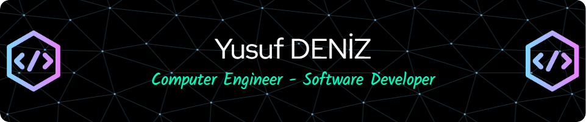

<h1> MAIN SKILLS </h1>

 

  
  
  
  
  
  
  
  
  
  
  
  
  
  
  
  

  

----

 

<h3> Tech Stack </h3>

 

 * C#, Java, Javascript, Typescript, Python
 * .NET Core, Entity Framework, Firebase, 
 * Arduino, NodeMCU, C++, Blynk, 
 * React, React Native, Angular, Redux, MUI, Bootstrap, HTML, CSS
 * DevOps, CI/CD, Docker, Kubernetes, AWS, ECS, CloudWatch, Terraform

----

